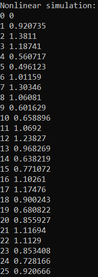

<p align="center"> Министерство образования Республики Беларусь</p>
<p align="center">Учреждение образования</p>
<p align="center">“Брестский Государственный технический университет”</p>
<p align="center">Кафедра ИИТ</p>
<br><br><br><br><br><br><br>
<p align="center">Лабораторная работа №1</p>
<p align="center">По дисциплине “Общая теория интеллектуальных систем”</p>
<p align="center">Тема: “Моделирования температуры объекта”</p>
<br><br><br><br><br>
<p align="right">Выполнил:</p>
<p align="right">Студент 2 курса</p>
<p align="right">Группы ИИ-27</p>
<p align="right">Дорошенко М.Д.</p>
<p align="right">Проверил:</p>
<p align="right">Иванюк Д.С.</p>
<br><br><br><br><br>
<p align="center">Брест 2025</p>

# Общее задание #
1. Написать отчет по выполненной лабораторной работе №1 в .md формате (readme.md) и с помощью запроса на внесение изменений (**pull request**) разместить его в следующем каталоге: **trunk\ii0xxyy\task_01\doc** (где **xx** - номер группы, **yy** - номер студента, например **ii02302**).
2. Исходный код написанной программы разместить в каталоге: **trunk\ii0xxyy\task_01\src**.
3. Выполнить рецензирование ([review](https://linearb.io/blog/code-review-on-github), [checklist](https://linearb.io/blog/code-review-checklist)) запросов других студентов (минимум 2-е рецензии).
4. Отразить выполнение работы в файле readme.md в соответствующей строке (например, для студента под порядковым номером 1 - https://github.com/brstu/OTIS-2023/edit/main/readme.md?#L17-L17).

## Task 1. Modeling controlled object ##
Let's get some object to be controlled. We want to control its temperature, which can be described by this differential equation:

$$\Large\frac{dy(\tau)}{d\tau}=\frac{u(\tau)}{C}+\frac{Y_0-y(\tau)}{RC} $$ (1)

where $\tau$ – time; $y(\tau)$ – input temperature; $u(\tau)$ – input warm; $Y_0$ – room temperature; $C,RC$ – some constants.

After transformation we get these linear (2) and nonlinear (3) models:

$$\Large y_{\tau+1}=ay_{\tau}+bu_{\tau}$$ (2)
$$\Large y_{\tau+1}=ay_{\tau}-by_{\tau-1}^2+cu_{\tau}+d\sin(u_{\tau-1})$$ (3)

where $\tau$ – time discrete moments ($1,2,3{\dots}n$); $a,b,c,d$ – some constants.

Task is to write program (**С++**), which simulates this object temperature.


## Код программы:
```C++
#include <iostream>
#include <memory>
#include <cmath>

class ISimulatedModel
{
public:
    virtual void simulate(double y, const double u, double t) const = 0;
    virtual ~ISimulatedModel() = default;

};
class LinearModel : public ISimulatedModel
{
public:
    LinearModel(double a, double b)
        : m_a(a), m_b(b) 
    {}
    ~LinearModel() override = default;

    void simulate(double y, const double u, double t) const override
    {   
        for(int i = 0; i <= static_cast<int>(t); i++)
        {
            std::cout << i << ' ' << y << std::endl;
            y = m_a * y + m_b * u;
        } 
    }

private:
    const double m_a;
    const double m_b;

};
class NonLinearModel : public ISimulatedModel
{
public:
    NonLinearModel(double a, double b, double c, double d)
            : m_a(a), m_b(b), m_c(c), m_d(d) 
    {}
    ~NonLinearModel() override = default;

    void simulate(double y, const double u, double t) const override
    {
        double prevY = 0;
        for(int i = 0; i <= static_cast<int>(t); i++)
        {
            std::cout << i << ' ' << y << std::endl;
            double nextY = m_a * y - m_b * prevY * prevY + m_c * u + m_d * sin(u);
            prevY = y;
            y = nextY;
        }
    }

private:
    const double m_a;
    const double m_b;
    const double m_c;
    const double m_d;

};


class IFactoryModel
{
public:
    virtual std::unique_ptr<ISimulatedModel> getModel() const = 0;
    virtual ~IFactoryModel() = default;

};
class FactoryLinearModel : public IFactoryModel
{
public:
    ~FactoryLinearModel() override = default;

    std::unique_ptr<ISimulatedModel> getModel() const override
    { return std::make_unique<LinearModel>(m_a, m_b); }

private:
    double m_a { 0.5 };
    double m_b { 0.5 };

};
class FactoryNonLinearModel : public IFactoryModel
{
public:
    ~FactoryNonLinearModel() override = default;

    std::unique_ptr<ISimulatedModel> getModel() const override
    { return std::make_unique<NonLinearModel>(m_a, m_b, m_c, m_d); }

private:
    double m_a { 0.5 };
    double m_b { 0.5 };
    double m_c { 0.5 };
    double m_d { 0.5 };

};

int main() 
{
    std::unique_ptr<IFactoryModel> factory;
    std::unique_ptr<ISimulatedModel> model;
    
    std::cout << "Write necessary data for calculation:" << std::endl;
    double y;
    std::cout << "y:"; std::cin >> y;
    double u;
    std::cout << "u:"; std::cin >> u;
    double t;
    std::cout << "t:"; std::cin >> t;
    std::cout << std::endl;

    std::cout << "Linear simulation:" << std::endl;
    factory = std::make_unique<FactoryLinearModel>();
    model = factory->getModel();
    model->simulate(y, u, t);
    std::cout << std::endl;

    std::cout << "Nonlinear simulation:" << std::endl; 
    factory = std::make_unique<FactoryNonLinearModel>();
    model = factory->getModel();
    model->simulate(y, u, t);
    std::cout << std::endl;

    return 0;
}
```

## Результат программы:
Ввод данных:
<br>

<br>
Вывод линейной симуляции:
<br>

<br>
Вывод нелинейной симуляции:
<br>



